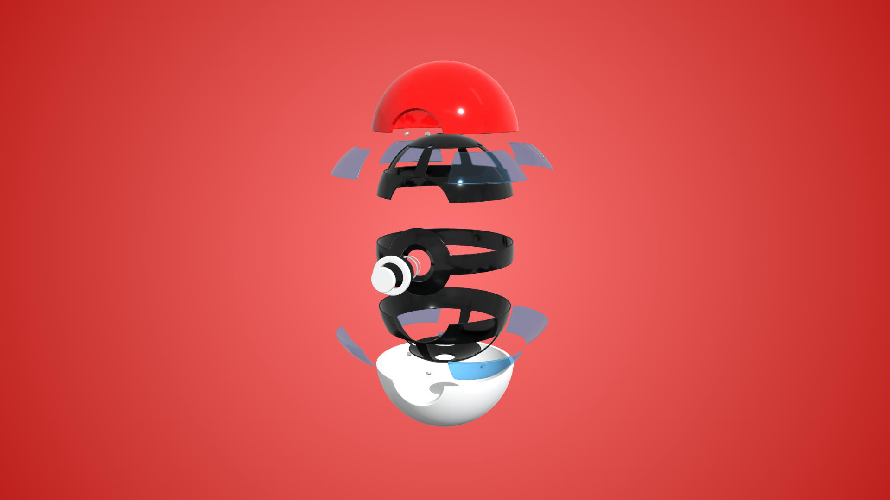

# Pokeball Build Kit Puzzle
Project created for one the [Three.js Journey](https://threejs-journey.com/) challenges. It's a simple puzzle game where you have to re build a pokeball in the right order and in the fastest time possible.



## Setup
To get started, you'll need to have [Node.js](https://nodejs.org/en/download/) installed on your machine.
Once you have Node.js installed, you can run the following commands to set up the project:

``` bash
# Install dependencies (only the first time)
npm install

# Run the local server at localhost:8080
npm run dev

# Build for production in the dist/ directory
npm run build
```

## Additional Credits
Music by [moodmode](https://pixabay.com/users/moodmode-33139253/?utm_source=link-attribution&utm_medium=referral&utm_campaign=music&utm_content=138828) from [Pixabay](https://pixabay.com/music//?utm_source=link-attribution&utm_medium=referral&utm_campaign=music&utm_content=138828)

Sound Effect from [Pixabay](https://pixabay.com/sound-effects/?utm_source=link-attribution&utm_medium=referral&utm_campaign=music&utm_content=47985)